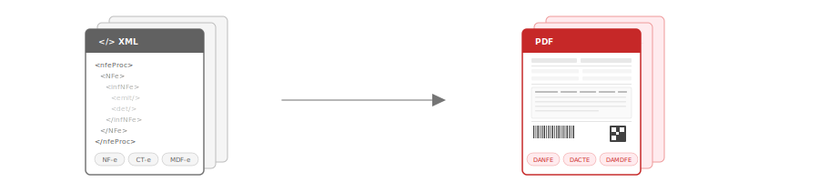

[](https://github.com/Engenere/BrazilFiscalReport/actions)
[](https://app.codecov.io/gh/Engenere/BrazilFiscalReport)
[](https://pypi.org/project/BrazilFiscalReport/)
[](https://pypi.org/project/BrazilFiscalReport/)
[](https://github.com/Engenere/BrazilFiscalReport/blob/main/LICENSE)
[](https://github.com/Engenere/BrazilFiscalReport/graphs/contributors)
[](https://pepy.tech/projects/brazilfiscalreport)

# Brazil Fiscal Report



Python library for generating Brazilian auxiliary fiscal documents in PDF from XML documents.

**[Documentation](https://engenere.github.io/BrazilFiscalReport/)** | **[PyPI](https://pypi.org/project/BrazilFiscalReport/)** | **[Try it Online](https://brazilfiscalreport.streamlit.app)**

## Supported Documents

| Document | Description | XML Source |
|----------|-------------|------------|
| **DANFE** | Documento Auxiliar da Nota Fiscal Eletrônica | NF-e |
| **DACCe** | Documento Auxiliar da Carta de Correção Eletrônica | CC-e |
| **DACTE** | Documento Auxiliar do Conhecimento de Transporte Eletrônico | CT-e |
| **DAMDFE** | Documento Auxiliar do Manifesto Eletrônico de Documentos Fiscais | MDF-e |

## Installation

```bash
pip install brazilfiscalreport
```

This installs the core library with support for **DANFE** and **DACCe**. For additional document types and features:

```bash
pip install 'brazilfiscalreport[dacte]'   # DACTE support (requires qrcode)
pip install 'brazilfiscalreport[damdfe]'  # DAMDFE support (requires qrcode)
pip install 'brazilfiscalreport[cli]'     # CLI tool
pip install 'brazilfiscalreport[dacte,damdfe,cli]'  # All extras
```

## Quick Start

```python
from brazilfiscalreport.danfe import Danfe

with open("nfe.xml", "r", encoding="utf8") as file:
    xml_content = file.read()

danfe = Danfe(xml=xml_content)
danfe.output("danfe.pdf")
```

The same pattern applies to all document types:

```python
from brazilfiscalreport.dacte import Dacte
from brazilfiscalreport.damdfe import Damdfe
from brazilfiscalreport.dacce import DaCCe

dacte = Dacte(xml=cte_xml)
dacte.output("dacte.pdf")

damdfe = Damdfe(xml=mdfe_xml)
damdfe.output("damdfe.pdf")

dacce = DaCCe(xml=cce_xml)
dacce.output("dacce.pdf")
```

## CLI

Generate PDFs directly from the terminal:

```bash
bfrep danfe /path/to/nfe.xml
bfrep dacte /path/to/cte.xml
bfrep damdfe /path/to/mdfe.xml
bfrep dacce /path/to/cce.xml
```

See the [CLI documentation](https://engenere.github.io/BrazilFiscalReport/cli/) for configuration options.

## Dependencies

- [FPDF2](https://github.com/py-pdf/fpdf2) - PDF creation library for Python
- [phonenumbers](https://github.com/daviddrysdale/python-phonenumbers) - Phone number formatting
- [python-barcode](https://github.com/WhyNotHugo/python-barcode) - Barcode generation
- [qrcode](https://github.com/lincolnloop/python-qrcode) - QR code generation (required for DACTE and DAMDFE)

## Credits

This is a fork of the [nfe_utils](https://github.com/edsonbernar/nfe_utils) project, originally created by [Edson Bernardino](https://github.com/edsonbernar).

## Maintainer

[](https://engenere.one/)
